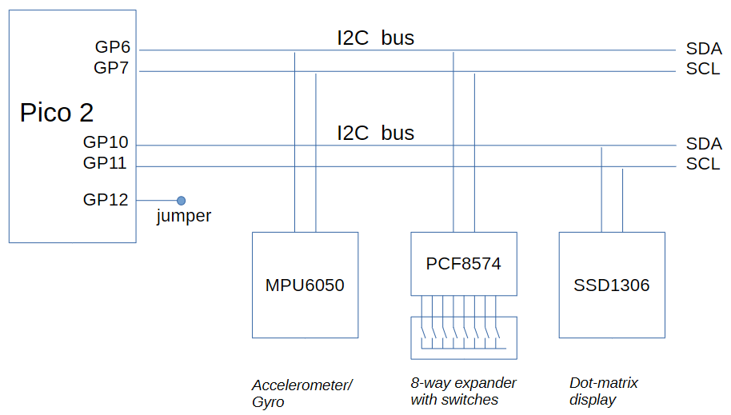

# NBI: A non-blocking I2C library for the Pico mcu

The **NBI (Non-Blocking I2C)** library for the Raspberry Pi 'Pico' range of microcontrollers allows I2C peripherals to be accessed without stalling program execution. This allows their use in programs that may have hard real-time constraints, such as a control loop with a 1ms cycle time.

As an example, an SSD1306 (a widely-used bit-mapped display module), driven in the usual way with blocking calls over an I2C bus, takes about 25ms to refresh its display. However, using these NBI library functions, it can instead be driven by a sequence of interrupts, each one lasting about 700ns.

The use of the NBI library is illustrated with a series of examples. The first three (*switches*, *scan* and *accel*) show how to use the core NBI functions to set up and access I2C busses. The last two (*display* and *display-gyro*) show how to use the (higher-level) functions in the *MPU6050* and  *SSD1306* sections of the library to access these devices in an interrupt-driven non-blocking mode.

The implementation of the NBI library exploits the innovative PIO (Programmable Input Output) feature of the 'Pico' microcontrollers (RP2040, onwards). In particular, it builds on the PIO code provided in the `pio_i2c_bus_scan` example found in the set of examples provided with the C/C++ SDK. This example (described in chapter 11 of the *RP2350 Datasheet*) allows a user to nominate *any* adjacent pair of pins to serve as an I2C bus and, in particular, it allows many such interfaces to be created.

*Although the NBI implementation makes use of the PIO, no knowledge of any of the PIO-related aspects of the implementation is required for using the NBI library.*

## The test board

The examples are based upon a simple test board containing a Pico 2 and three typical I2C devices: an MPU6050 accelerometer/gyro, a PCF8574 8-way expander, and an SSD1306 OLED dot-matrix display. Two pairs of GPIO pins are used to realise the I2C busses to which the peripherals are connected. 

*These busses are totally independent of and unrelated to the 'standard' I2C bus configuration defined by the Pico hardware.*
They have been (arbitrarily) chosen to use GPIOs 5 & 6 and GPIOs 10 & 11.

