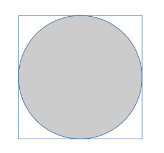
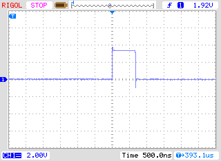

# Display

This example shows how to drive an SSD1306 dot-matrix display using the non-blocking functions in the NBI library. This allows it to be used effectively in programs having hard, real-time constraints.

The example demonstrates two tasks running concurrently:

- A benchmark task that estimates a value for pi, and

- A background task that continuously updates an SSD1306 display showing the progress being made by the benchmark task without significantly slowing it down.

### The NBI SSD1306 functions

The SSD1306 is an 128 x 64 pixel dot-matrix display module with an I2C interface intended to be driven with a clock-rate of up to 400 kHz. It displays a 64 x 128 array of pixels and so refreshing the display involves a transfer of 1KiB of data (plus a short preamble).
Thus, a  refresh of the display involves an I2C transaction taking about 25ms. The functions in this library allow this transaction to be carried out under interrupt control and thus avoid this 25 ms delay.

The library includes the following functions:

- `display_init(chan, size)`   This initialises the system to use I2C channel number `chan` and to display at the given font size (either `SMALL` or `BIG`).

- `display_set(line, fmt, a1, ..., an)` This specifies that the given `fmt` string (with arguments substituted as in the usual `printf` function) is to be displayed on line number `line` of the display. But  note that *it does not itself actually update the display*.

- `display()` This initiates the updating of the display. The function itself is non-blocking: *it will always return immediately.* The actual updating of the display is carried out in the background under interrupt control. (If, when this function is called, the display is part-way though an update, this is allowed to complete and then a further update is automatically initiated. This ensures that, no matter how frequently the `display` function is called, it doesn't result in an endless series of partly rendered screens.)

### The benchmark task

The benchmark task involves estimating the value of $\pi$ by simulating the throwing darts at a square dartboard.



The chances of a dart, thrown at random, landing within the inscribed circle is (from the ratio of the areas of the circle to the square)  $\pi / 4$. The benchmark task uses one million throws to form its estimate. (Other ways of calculating $\pi$ are available . . .)

### The program

The program (see accompanying file `main.c`) begins by setting up an I2C channel: this involves specifying the GPIO pin for the SDA line (for the test board, this is GPIO pin 10) and the speed at which it is to run (in this case, at the I2C  `FAST` speed of 400 kHz):

```c
const uint SDA = 10;
uint chan = nbi_create_channel(SDA,  FAST); 
```

The SSD1306 subsystem is then initialised to run on this channel and to use a small font

```c
    display_init(chan, SMALL);
```

It then starts the benchmark task,  the simulation of a million random throws of a dart. After each iteration, it calls for the display to be updated:

```c
display_set(3, "Iterations: %u", throws);
display_set(5, "Estimate: %6.5f", pi_estim);
display();  
```

After the benchmark task is complete, it displays the elapsed time taken by the benchmark task.  By commenting out the above  `display( )` statement, the interrupt-driven update of the display can be avoided; this allows the overhead imposed by the display to be measured.

## Performance

This video [*NOT* yet included] shows part of a typical run of the program:

[Video]


As this trace shows, each interrupt takes about 700 ns to handle and (at the `FAST` speed) these interrupts are about 25 us apart.



When the benchmark task is run *with* live updating of the display it takes 28.2 seconds to complete. When it is run *without* using the display, it takes about 25.1 seconds.

### An aside

This example has taken a free-wheeling approach to synchronisation issues (essentially by totally ignoring them). Since the NBI library generates the rendering data for the SSD1306 on the fly (rather than by the conventional approach of using a frame buffer), if the information to be rendered happens to change during the rendering of a frame, this can result in the upper part of a character position being rendered with one value (eg, a "2") while the lower part is rendered with a different value (eg, a "5"). However, since the display is being continuously updated every 25ms the occasional fleeting display of a chimeric character is unlikely to be a problem.
